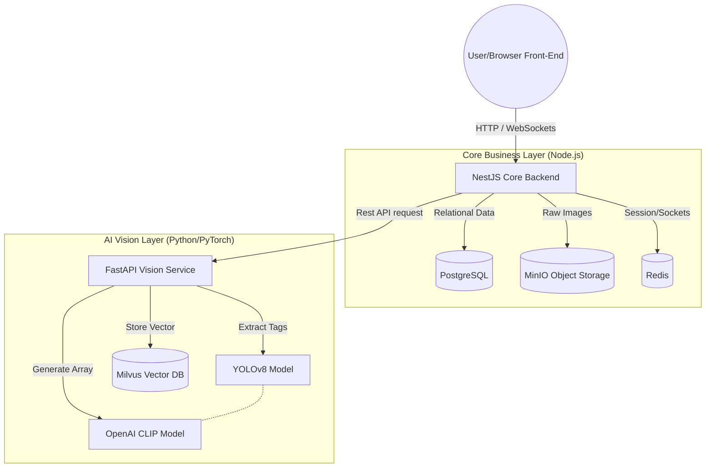
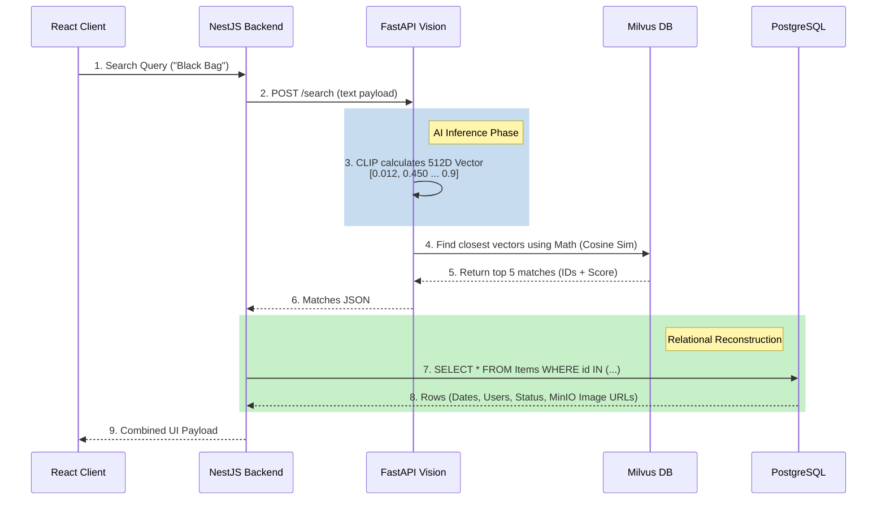

# Current System Architecture

The Universal Recovery System currently operates on a modern, **Microservices-oriented architecture** deployed locally via Docker. It efficiently separates standard application business logic and data persistence from heavy machine learning computations.

Here is how the components currently interact with each other in your development environment:

---

## 1. The Presentation Layer (`web-client`)
*   **Tech Stack:** React 19, TypeScript, Vite, TailwindCSS v4.
*   **Role:** Provides the user interface. It communicates securely with the Core Backend using JSON Web Tokens (JWT) for authentication via standard REST APIs (using Axios) and uses Socket.IO for real-time pushing (like instant match notifications).

## 2. The API Gateway & Business Engine (`core-backend`)
*   **Tech Stack:** NestJS, TypeORM, Passport.js.
*   **Role:** This is the orchestrator. Everything flows through NestJS first.
    1.  **Authentication:** Validates JWTs, secures routes, handles login mechanisms using `bcrypt`.
    2.  **Relational State:** Manages the canonical truth of the system (Users, Items, Timestamps, Locations) inside **PostgreSQL 15**.
    3.  **Blob Storage:** When an image is uploaded, NestJS utilizes `multer` to intercept it and deposits the raw file into **MinIO** (a local S3 alternative payload bucket).
    4.  **Handoff:** Crucially, NestJS never attempts to evaluate AI natively. It acts as an API gateway, forwarding the stored payload parameters to the `vision-service` over a synchronous HTTP connection.

## 3. The Artificial Intelligence Engine (`vision-service`)
*   **Tech Stack:** FastAPI, PyTorch, Transformers.
*   **Role:** An isolated, heavy computational service that manages AI models.
    1.  **YOLOv8 Inference:** Analyzes the raw images and performs bounding-box Object Detection to extract text-based context tags (e.g. "backpack", "bottle"). Note: In your current flow, this operates purely to append text to the description, not for the vector logic.
    2.  **CLIP Inference:** Passes the query (either an image or text sequence) through OpenAI's CLIP model. CLIP translates the visual or textual meaning into a massive 512-dimensional array of numbers (Dense Vector).
    3.  **Vector Persistence:** Opens a connection to **Milvus** on port 19530 and saves the computed vector array using the exact same ID (`external_id`) that NestJS used for PostgreSQL. 

## 4. The Database Infrastructure (`docker-compose`)
*   **PostgreSQL:** Handles exact relational mappings (e.g., *Is User 123 the owner of Item 456?*).
*   **Redis:** Serves as a fast, ephemeral cache. In this context, it acts as the pub/sub engine allowing Socket.IO events to trigger across distributed connections.
*   **MinIO:** Retains the heavy unstructured payloads (Raw Images/Videos).
*   **Milvus (v2.3.0 Standalone):** An advanced vector-specific database. When the Python service executes a search, Milvus takes the query vector array and uses an **Inner Product (IP)** calculation with an **IVF_FLAT** index to find vectors that mathematically point in the closest direction. 

---

### Sequence Diagram: The "Search" Flow

When a user tries to search for an item, this is the exact flow data takes currently:

