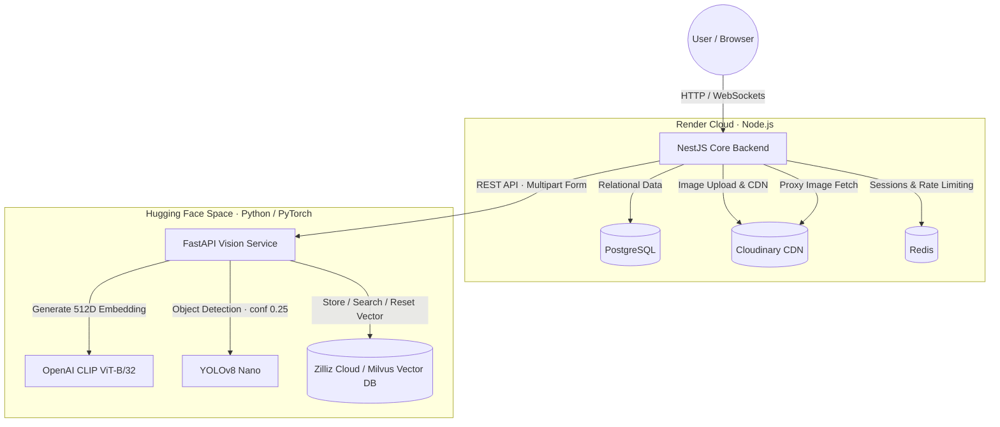
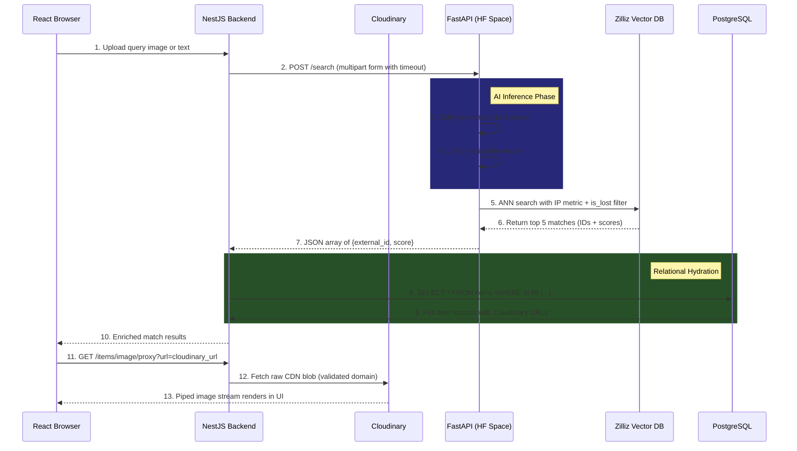

# 🔍 Universal Recovery System

> **One-liner:** A full-stack, AI-powered Lost & Found platform that uses computer vision and vector similarity search to automatically identify and recover lost items through visual semantics — not keywords.

---

## 📌 Project Overview

Universal Recovery System replaces traditional text-based lost-and-found workflows with an intelligent, image-driven matching engine. Users can report lost or found items by uploading photos. The system uses OpenAI's CLIP neural network to convert those images into mathematical vectors (embeddings), stores them in a specialized vector database, and then allows anyone to search by uploading a photo or typing a natural-language description (e.g., *"a black backpack"*). The system performs **cosine similarity** matching across all stored vectors and returns the most visually similar items — even if no textual metadata matches. Users who find a match can then communicate in real-time via a built-in WebSocket-powered chat system.

---

## 🏗️ System Architecture

The project follows an **isolated microservices architecture** distributed across cloud providers. Heavy AI inference is deliberately decoupled from the core API gateway to prevent thread-blocking and allow independent horizontal scaling.


```mermaid
graph TD
    User((User / Browser)) -->|HTTP / WebSockets| Gateway[NestJS Core Backend]
    
    subgraph "Render Cloud · Node.js"
        Gateway -->|Relational Data| PG[(PostgreSQL)]
        Gateway -->|Image Upload & CDN| Cloudinary[(Cloudinary CDN)]
        Gateway -->|Sessions & Rate Limiting| Redis[(Redis)]
        Gateway -->|Proxy Image Fetch| Cloudinary
    end
    
    subgraph "Hugging Face Space · Python / PyTorch"
        Gateway -->|REST API · Multipart Form| Vision[FastAPI Vision Service]
        Vision -->|Generate 512D Embedding| CLIP[OpenAI CLIP ViT-B/32]
        Vision -->|Object Detection · conf 0.25| YOLO[YOLOv8 Nano]
        Vision -->|Store / Search / Reset Vector| Zilliz[(Zilliz Cloud / Milvus Vector DB)]
    end
```

### Three-Service Breakdown

| Service | Language | Framework | Deployed On |
|---|---|---|---|
| **Web Client** (Presentation Layer) | TypeScript | React 19 + Vite 7 + TailwindCSS v4 | Render (Static Site) |
| **Core Backend** (API Gateway & Orchestrator) | TypeScript | NestJS 11 + TypeORM | Render (Web Service) |
| **Vision Service** (AI/ML Engine) | Python | FastAPI + PyTorch + Ultralytics | Hugging Face Spaces (Docker) |

### Four-Database Strategy

| Database | Type | Purpose |
|---|---|---|
| **PostgreSQL** (Render) | Relational (SQL) | Users, Items (with vector/tags), Conversations, Messages — canonical truth |
| **Zilliz Cloud** (Milvus-compatible) | Serverless Vector DB | 512-dimensional CLIP embeddings for ANN similarity search (IVF_FLAT, IP metric) |
| **Cloudinary** | Cloud CDN / Object Storage | Raw image uploads via stream piping, CDN URL storage |
| **Redis** (with in-memory fallback) | In-memory Key-Value | Single-device session enforcement, JWT session revocation, rate limiting |

---

## 🛠️ Complete Tech Stack

### Frontend
- **React 19** — Latest React with concurrent features
- **TypeScript** — Full static type safety
- **Vite 7** — Next-generation build tool with instant HMR
- **TailwindCSS v4** — Utility-first CSS framework (via `@tailwindcss/vite` plugin)
- **React Router v7** — Client-side routing with 10+ routes
- **Axios** — HTTP client with interceptors and credential forwarding
- **Socket.IO Client** — Real-time WebSocket communication
- **Lucide React** — Icon library
- **clsx + tailwind-merge** — Dynamic className composition utilities

### Backend (API Gateway)
- **NestJS 11** — Enterprise-grade Node.js framework with modular architecture
- **TypeORM** — Object-Relational Mapper with entity decorators and migrations
- **PostgreSQL 15** (via `pg` driver) — Primary relational database
- **Passport.js** — Authentication middleware (JWT strategy)
- **@nestjs/jwt** — JSON Web Token signing and verification
- **@nestjs/throttler** — Global and route-specific rate limiting
- **ioredis** — Redis client for session lifecycle management
- **helmet** — Security HTTP header hardening
- **bcrypt** — Password hashing with salted rounds
- **Multer** — Multipart file upload handling with magic-byte validation
- **Cloudinary SDK** — Direct image upload via stream piping
- **Streamifier** — Buffer-to-stream conversion for Cloudinary uploads
- **Nodemailer** — Transactional email (password reset via Gmail SMTP)
- **Socket.IO** — WebSocket server with handshake JWT authentication
- **cookie-parser** — Secure HTTPOnly cookie parsing
- **class-validator + class-transformer** — DTO validation with decorators
- **Axios** — Internal HTTP calls to the Vision Service
- **form-data** — Multipart form construction for inter-service communication

### AI / Vision Service
- **FastAPI** — High-performance async Python web framework
- **PyTorch** — Deep learning tensor computation framework
- **Hugging Face Transformers** — Model loading and inference pipeline
- **OpenAI CLIP** (`clip-vit-base-patch32`) — Vision-Language model for generating 512D embeddings
- **YOLOv8 Nano** (Ultralytics) — Real-time object detection neural network
- **Pillow (PIL)** — Image preprocessing and format conversion
- **NumPy** — Numerical array operations
- **PyMilvus** — Python SDK for Milvus/Zilliz vector database
- **Uvicorn** — ASGI server for production deployment

### DevOps & Infrastructure
- **Docker** — Containerized Vision Service with multi-stage Dockerfile
- **Docker Compose** — Local development orchestration (PostgreSQL, Redis, MinIO, Milvus)
- **Render** — Cloud hosting for backend + frontend + PostgreSQL
- **Hugging Face Spaces** — GPU-enabled hosting for AI inference service
- **render.yaml** — Infrastructure-as-Code deployment blueprint
- **Artillery** — Load testing framework (YAML-based test scenarios)
- **ESLint + Prettier** — Code quality and formatting
- **Jest + Supertest** — Unit and E2E testing framework

---

## 🧠 AI / Machine Learning Concepts

### 1. CLIP (Contrastive Language-Image Pretraining)
- Developed by **OpenAI**, CLIP is a neural network trained on 400 million image-text pairs from the internet
- It learns a **shared embedding space** where images and text can be directly compared
- The model used is `clip-vit-base-patch32` which uses a **Vision Transformer (ViT)** as the image encoder
- Outputs a **512-dimensional float vector** for any input (image or text)
- This enables **cross-modal search**: searching images with text queries and vice versa

### 2. Vector Embeddings & Similarity Search
- Every uploaded image is converted into a **512-dimensional floating-point array** (vector embedding)
- These vectors capture the **semantic meaning** of the image — not pixels, but concepts
- Search is performed using **Inner Product (IP) similarity** on L2-normalized vectors, which is mathematically equivalent to **Cosine Similarity**
- Cosine similarity measures the angle between two vectors in high-dimensional space — smaller angle = more similar
- The formula: `similarity = (A · B) / (||A|| × ||B||)`, range: [-1, 1]

### 3. Vector Normalization
- All CLIP outputs are **L2-normalized** before storage: `vector / ||vector||₂`
- This ensures all vectors lie on a unit hypersphere, making Inner Product equivalent to Cosine Similarity
- Normalization prevents magnitude bias — only direction (semantic meaning) matters

### 4. YOLOv8 Object Detection
- **You Only Look Once (YOLO)** v8 Nano model performs real-time object detection on uploaded images
- Runs at a confidence threshold of 0.25 to maximize detection coverage
- Detected object labels (e.g., "backpack", "phone", "bottle") are appended to the item description
- This enriches the metadata stored alongside each vector for better context

### 5. IVF_FLAT Indexing
- The vector database uses **Inverted File Index with Flat quantization** (IVF_FLAT)
- Vectors are partitioned into 128 clusters (nlist=128) using k-means
- At search time, only the nearest 10 clusters are scanned (nprobe=10), dramatically reducing search time
- This is an **Approximate Nearest Neighbor (ANN)** algorithm — trades minor accuracy for massive speed gains

### 6. Cross-Modal Search
- Because CLIP maps both images and text into the **same 512D vector space**, users can:
  - Upload a **photo** → system generates image embedding → searches against stored image embeddings
  - Type a **text description** → system generates text embedding → searches against stored image embeddings
- This is the key innovation: a text query like *"red umbrella"* will match a photo of a red umbrella even if no text metadata exists

### 7. Filtered Vector Search
- Search queries support boolean metadata filtering (e.g., `is_lost == true`)
- Milvus applies the scalar filter **before** the ANN search, narrowing the candidate set
- This allows users to search specifically for lost items or found items

---

## 🔐 Security & Hardening Architecture

### 1. Cookie-Based JWT & Redis Session Management
- **HttpOnly Secure Cookies:** JWT tokens are stored in `HttpOnly`, `secure: true`, `sameSite: 'none'` cookies, preventing XSS-based credential theft.
- **Fail-Closed Secrets:** Bootstrapping fails immediately if `JWT_SECRET` is unset, preventing predictable signature vulnerabilities.
- **Redis Session Revocation with Memory Fallback:** Each login assigns a unique `sid` (session ID) stored in Redis with 1-hour TTL. If Redis is unavailable (e.g., local dev), an in-memory `Map` with TTL-based expiry acts as a fallback. Logout or password reset immediately invalidates the active session.
- **Single-Device Enforcement:** Creating a new session implicitly overwrites any previous session for the same user, enforcing single-device login.

### 2. WebSocket Handshake Authentication
- Real-time Socket.IO connections run a custom `createWsJwtMiddleware` during connection handshake that validates JWT and session ID.
- Unauthenticated or forged connection requests are dropped before entering rooms.
- **Server-Derived Identity:** In all chat events (`send_message`, `delete_message`), `senderId` is resolved exclusively from `client.data.user.id` (set during handshake verification) rather than client-supplied payloads, preventing impersonation.

### 3. IDOR / BOLA Prevention
- Chat room joining (`join_room`), message retrieval, and message sending all enforce strict participant `verifyMembership()` checks against PostgreSQL records.
- Supports both UUID-based conversation IDs and legacy `chat_item_` prefixed IDs with participant extraction and validation.
- Non-participant attempts to query or post to conversations result in immediate `403 Forbidden` responses.

### 4. File Upload & Magic-Byte Verification
- File uploads are validated through MIME-type checks, a 5MB size limit, and header signature (magic byte) inspection (JPEG `FF D8 FF`, PNG `89 50 4E 47`, WebP `RIFF...WEBP`, GIF `GIF87a`/`GIF89a`).
- File extension spoofing is detected and blocked before reaching disk or cloud pipelines.

### 5. SSRF-Hardened Image Proxy
- Cloudinary images are proxied through `GET /items/image/proxy?url=` to circumvent ISP/tracker blocks.
- URLs are strictly parsed using the standard `URL` constructor, restricting destinations to `https://res.cloudinary.com` and rejecting embedded user credentials (`parsed.username`, `parsed.password`).
- Upstream response `Content-Type` is validated to start with `image/` before piping to the client.

### 6. CSRF & Network Protection
- CSRF middleware (`CsrfMiddleware`) validates custom request headers (`X-Requested-With: XMLHttpRequest`) and whitelisted origins for all mutating HTTP methods (POST, PUT, DELETE, PATCH). Applied globally via `AppModule.configure()`.
- **Tiered Rate Limiting:** Global default (60 req/min) with route-specific overrides — login (5/min), forgot-password (3/min), reset-password (5/min), item creation (10/min), search (20/min), image proxy (30/min).
- HTTP security headers are enforced via `helmet` with `crossOriginResourcePolicy: 'cross-origin'` for proxied images. Request body payloads are capped at 1MB.
- Internal service-to-service endpoints (`/reset`) require shared secret authentication via `X-Internal-Key` header.

---

## 📦 Backend Module Architecture (NestJS)

The backend follows NestJS's **modular architecture pattern** with dependency injection. Four feature modules (`AuthModule`, `UsersModule`, `ItemsModule`, `ChatModule`) are imported into the root `AppModule`.

### 1. Auth Module
- **Controller:** `POST /auth/login`, `POST /auth/logout`, `GET /auth/me`, `POST /auth/forgot-password`, `POST /auth/reset-password`
- **Service:** Handles login (credential verification via bcrypt), JWT signing with embedded session ID (`sid`), session generation/revocation, and password reset logic (SHA-256 hashed tokens stored in PostgreSQL)
- **JWT Strategy:** Custom Passport strategy extracting JWTs from HttpOnly cookies (with Bearer header fallback) and validating the embedded `sid` against Redis/memory session store
- **Session Service:** Redis-backed session store (`ioredis`) with automatic in-memory `Map` fallback. Implements `createSession()`, `validateSession()`, and `revokeSession()` for single-device enforcement
- **Email Service:** Nodemailer-based transactional email for password reset links via Gmail SMTP
- **Guard:** `DebugAuthGuard` wrapping `AuthGuard('jwt')` used across protected routes

### 2. Users Module
- **Controller:** `POST /users` (create/signup), `GET /users` (list all), `GET /users/:id`, `PATCH /users/:id`, `DELETE /users/:id`
- **Service:** CRUD operations with duplicate email detection (`ConflictException`), bcrypt password hashing with salt, reset token management (`setResetToken`, `findByResetToken`, `updatePasswordAndClearToken`)
- **Entity:** `User` — id (UUID), email (unique), passwordHash, fullName, isVerified (boolean), resetPasswordToken (nullable), resetPasswordExpires (nullable timestamp), createdAt, updatedAt

### 3. Items Module
- **Controller:** `POST /items` (create with file upload), `POST /items/search` (text-only search), `GET /items` (list all), `GET /items/mine` (user's items), `GET /items/image/proxy` (SSRF-protected CDN proxy), `DELETE /items/nuke` (admin-only, production-disabled)
- **Service:**
  - **Create flow:** Validate file (magic bytes) → Upload image buffer to Cloudinary via stream → Save `Item` to PostgreSQL → POST multipart form to Vision Service `/analyze` (30s timeout) → Receive detected objects + vector → Update item `tags` and `vector` in PostgreSQL. If item `isLost`, automatically searches for matching found items (image vector search against `is_lost=false` filter), excludes self-posted items, returns top 5 sorted by score.
  - **Search flow:** Forward text query (URL-encoded form) or image (multipart) to Vision Service `/search` with optional `filter_is_lost` → Receive top-5 vector matches with `external_id` and `score` → Hydrate from PostgreSQL using `IN` clause with user relations → Return merged results
  - **Proxy flow:** Parses URL with `new URL()`, validates `https://res.cloudinary.com` origin, rejects embedded credentials, validates upstream `Content-Type` starts with `image/`, pipes raw blob with 1-year cache header
- **Entity:** `Item` — id (UUID), description, imageUrl, tags (simple-array, nullable — YOLO detected labels), vector (float array, nullable — 512D CLIP embedding), isLost (boolean, default false), user (ManyToOne → User), createdAt

### 4. Chat Module
- **Controller:** `POST /chat/start` (create/deduplicate conversation), `GET /chat/inbox` (user's conversations with last message preview), `GET /chat/conversations` (backward-compatible alias), `GET /chat/:conversationId/messages` (with membership verification), `DELETE /chat/message/:id` (sender-only soft delete)
- **Service:**
  - Conversation deduplication using `finderId + receiverId + itemId` composite lookup
  - Legacy conversation ID parsing: `chat_item_{itemId}_finder_{finderId}_seeker_{seekerId}` format support
  - Inbox transformation: returns `conversationId` (legacy format), `dbId`, `otherUserName`, `otherUserId`, `content` (last message preview), `updatedAt`, `itemId`
  - `verifyMembership()` — IDOR-safe authorization check supporting both UUID and legacy ID formats
  - Soft delete: sets `content` to `'🚫 This message was deleted'` and `isDeleted = true`
- **WebSocket Gateway (`ChatGateway`):**
  - Room-based architecture with `activeUsers` Map tracking `userId → socketId`
  - `afterInit()`: Applies `createWsJwtMiddleware` for handshake JWT + session validation
  - Events: `join_room` (with membership check), `send_message` (server-derived `senderId`), `get_messages`, `delete_message` (sender-only with broadcast)
  - Connection lifecycle: emits `user_status` (online/offline) and `online_users` list on connect
  - Real-time notifications emitted to receiver's socket on new message
- **Entities:**
  - `Conversation` — id (UUID), itemId, finder (ManyToOne → User), receiver (ManyToOne → User), messages (OneToMany → Message), createdAt, updatedAt
  - `Message` — id (UUID), content, isDeleted (boolean, default false), conversation (ManyToOne → Conversation, CASCADE delete), sender (ManyToOne → User), createdAt

---

## 🖥️ Frontend Architecture (React)

### Routing (9 Routes)
| Route | Page Component | Auth Required |
|---|---|---|
| `/` | `Home` (landing page) | No |
| `/login` | `Login` (login form) | No |
| `/signup` | `Signup` (registration form) | No |
| `/report-lost` | `ReportLost` (report lost item with image upload + auto-match) | Yes |
| `/report-found` | `ReportFound` (report a found item) | Yes |
| `/inbox` | `Inbox` (real-time chat inbox with `ChatWindow`) | Yes |
| `/profile` | `Profile` (user profile + reported items) | Yes |
| `/forgot-password` | `ForgotPassword` (password reset request) | No |
| `/reset-password` | `ResetPassword` (password reset form, token-based) | No |
| `*` | Redirects to `/` | No |

**Additional Page Components** (not in router but available): `SearchItems` (text-based AI search), `UploadLost`

### Component Hierarchy
- **`App`** → `AuthProvider` → `SocketProvider` → `BrowserRouter` → `AppContent`
- **`AppContent`** → `Navbar` + `Routes` (with `ProtectedRoute` wrapper for auth-required pages)
- **`Inbox`** → `ChatWindow` (Socket.IO-powered real-time messaging)

### State Management
- **AuthContext:** Global authentication state using React Context API. On mount, calls `GET /auth/me` to check for existing session cookie. Provides `user`, `isAuthenticated`, `isLoading`, and `setUser` to the entire app tree via `useAuth()` hook.
- **SocketContext:** Manages Socket.IO lifecycle tied to authentication state. Connects when user is present, disconnects on logout. Provides the socket instance to chat components via `useSocket()` hook.

---

## 🔀 Core Data Flow: End-to-End Search Sequence


```mermaid
sequenceDiagram
    participant Client as React Browser
    participant Nest as NestJS Backend
    participant Cloud as Cloudinary
    participant Fast as FastAPI (HF Space)
    participant Zil as Zilliz Vector DB
    participant PG as PostgreSQL

    Client->>Nest: 1. Upload query image or text
    Nest->>Fast: 2. POST /search (multipart form with timeout)
    
    rect rgb(40, 40, 120)
        Note right of Fast: AI Inference Phase
        Fast->>Fast: 3. CLIP generates 512D vector
        Fast->>Fast: 4. L2 normalize the vector
    end

    Fast->>Zil: 5. ANN search with IP metric + is_lost filter
    Zil-->>Fast: 6. Return top 5 matches (IDs + scores)
    Fast-->>Nest: 7. JSON array of {external_id, score}
    
    rect rgb(40, 80, 40)
        Note left of PG: Relational Hydration
        Nest->>PG: 8. SELECT * FROM items WHERE id IN (...)
        PG-->>Nest: 9. Full item records with Cloudinary URLs
    end

    Nest-->>Client: 10. Enriched match results
    Client->>Nest: 11. GET /items/image/proxy?url=cloudinary_url
    Nest->>Cloud: 12. Fetch raw CDN blob (validated domain)
    Cloud-->>Client: 13. Piped image stream renders in UI
```

---

## 🔀 Core Data Flow: Item Registration Sequence

1. **User uploads** an image + metadata (description, type: 'lost'/'found') via the React form
2. **NestJS receives** the multipart request via `FileInterceptor` and validates file size (5MB limit), MIME-type, and magic bytes via `validateUploadedFile()`
3. **Cloudinary upload:** Raw image buffer is streamed to Cloudinary's secure upload API via `uploadToCloudinary()`, returning a CDN URL
4. **PostgreSQL insert:** A new `Item` record is created with description, imageUrl, isLost flag, empty tags/vector arrays, and user relation
5. **Vision Service call:** NestJS posts the file buffer, item ID, description, and `is_lost` flag as multipart form to FastAPI `/analyze` with a 30-second timeout
6. **YOLO detection:** Vision Service runs YOLOv8 Nano on the image, detecting object classes (>25% confidence), deduplicates labels
7. **CLIP embedding:** The image passes through CLIP ViT, producing a 512D tensor which is L2-normalized (`vector / ||vector||₂`)
8. **Vector storage:** The normalized embedding, PostgreSQL item ID (as `external_id`), enriched description (original + YOLO labels), and `is_lost` boolean are inserted into Zilliz Cloud collection `lost_items_v3` and flushed
9. **Metadata update:** Detected labels are saved to `tags` and the full 512D vector is saved to `vector` in PostgreSQL
10. **Auto-matching (Lost items only):** If `isLost=true`, the service immediately performs a vector search against all **found** items (`filter_is_lost=false`), excludes self-posted items, sorts by similarity score descending, and returns the top 5 matches alongside the saved item

---

## 🚀 Environment Setup & Deployment

### 1. Local Development with Docker Compose

Four local services can be spun up simultaneously:
```bash
docker-compose up -d
```
- **PostgreSQL 15** — Relational database (`localhost:5432`)
- **Redis 7** — Session storage & rate limit cache (`localhost:6379`)
- **MinIO** — S3-compatible local object store (`localhost:9000` / dashboard `localhost:9001`)
- **Milvus Standalone** — Local vector database (`localhost:19530`)

### 2. Running Services Locally

```bash
# Core Backend
cd apps/core-backend
npm install
npm run build
npm run start:dev

# Vision Service
cd apps/vision-service
pip install -r requirements.txt
python src/main.py

# Web Client
cd apps/web-client
npm install
npm run dev
```

---

## 🧪 Testing & Quality

- **Security Test Suite:** `npm test` runs automated tests for magic-byte file validation, token hashing, and CSRF protection.
- **Backend Unit & E2E Testing:** Jest + Supertest test suites covering controllers and services.
- **Load Testing:** Artillery load scenarios simulating warm-up (2 RPS), sustained traffic (5 RPS), and high-load thresholds.
- **Linting & Code Quality:** ESLint, Prettier, and TypeScript strict compiler checks.

---

## 📈 Hyper-Scale Architecture Blueprint (100K RPS)

The repository includes architectural scaling blueprints for transitioning from prototype to 100,000 requests per second:

1. **Edge Caching (Cloudflare / CloudFront):** Static assets and cached top-K vector search results absorb ~40% of traffic at the CDN layer.
2. **Horizontal API Gateway Scaling:** 50–100 NestJS pods behind Kubernetes Horizontal Pod Autoscaler (HPA) with L7 load balancing.
3. **Asynchronous Event-Driven Pipeline:** Replace synchronous AI calls with **Apache Kafka** message queues — API gateway queues image references and responds with `202 Accepted` immediately.
4. **GPU Worker Fleet:** Auto-scaled FastAPI workers on NVIDIA GPU instances consuming batches from Kafka topics.
5. **Dynamic Inference Batching:** Workers batch up to 64 images simultaneously through the CLIP Vision Transformer, achieving 1000%+ throughput gains.
6. **Database Connection Pooling:** PgBouncer deployed in front of Amazon Aurora PostgreSQL with read replicas.
7. **Distributed Vector Cluster:** Distributed Milvus deployment separating Data Nodes, Index Nodes, and Query Nodes.
8. **WebSocket Scaling:** Redis Pub/Sub adapter to broadcast Socket.IO events across all distributed backend nodes.

---

## 📝 Key Engineering Concepts Used

| Concept | Where Applied |
|---|---|
| **Microservices Architecture** | Three independent services communicating over authenticated HTTP/REST with multipart form payloads |
| **Vector Embeddings** | CLIP model converts images/text into 512D mathematical representations stored in both Milvus and PostgreSQL |
| **Approximate Nearest Neighbor (ANN)** | IVF_FLAT index (nlist=128, nprobe=10) for sub-millisecond similarity search |
| **Cross-Modal Search** | Text queries match against image embeddings in shared 512D vector space |
| **Cosine Similarity** | Semantic matching via Inner Product on L2-normalized vectors |
| **Object Detection** | YOLOv8 Nano identifies objects in uploaded images for description enrichment and tag storage |
| **JWT & Session Revocation** | Stateless tokens with Redis single-device session tracking and in-memory fallback |
| **WebSocket (Socket.IO)** | Bidirectional real-time chat with room-based broadcasting, JWT handshake auth, and online presence tracking |
| **Soft Delete** | Messages are soft-deleted by replacing content and setting `isDeleted` flag, preserving conversation history |
| **Image Proxy / ISP Bypass** | Backend proxies CDN images with SSRF protection, credential rejection, and content-type validation |
| **Stream Processing** | Buffer-to-stream piping for Cloudinary uploads and image proxying |
| **ORM (TypeORM)** | Declarative entity mapping with automated schema synchronization (disabled in production) |
| **DTO Validation** | class-validator decorators for type-safe input validation |
| **Dependency Injection** | NestJS IoC container for modular, testable architecture |
| **Infrastructure as Code** | render.yaml and docker-compose.yml define entire deployment topology |
| **Multi-Cloud Distribution** | Services span Render, Hugging Face, Zilliz, and Cloudinary |
| **Graceful Degradation** | Session management falls back from Redis to in-memory store transparently |
