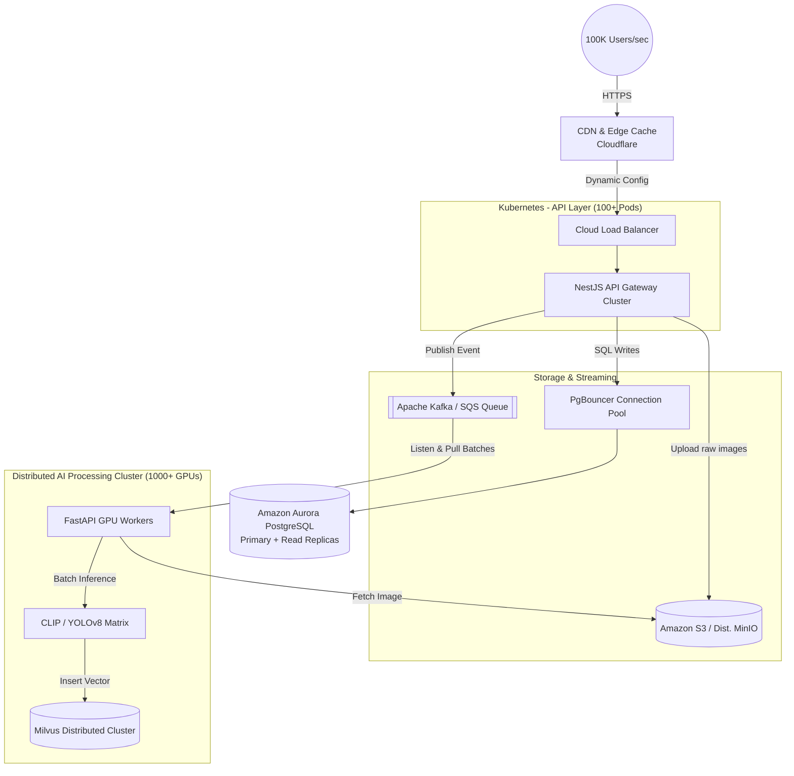

# Scaling to 100k Requests Per Second (Hyper-Scale)

Handling 100,000 users per second (RPS) is "Twitter/Uber scale." The hardware and infrastructure to do this will be expensive, but the architecture to achieve it is a well-understood science. 

To go from 5 RPS to 100,000 RPS, your architecture must change from **Synchronous to Asynchronous**, and from **Standalone to Distributed**. Here is the blueprint you would follow.

---

## 1. The Entry Point: Edge Caching & Load Balancing
At 100k RPS, you cannot let all traffic hit your servers.
*   **CDN (Cloudflare / CloudFront):** All web client static assets, cached search results, and DDoS protection happen here. This instantly shields your servers from ~40% of the traffic.
*   **L7 Load Balancer:** Distributes the incoming API requests evenly across hundreds of active NestJS containers based on CPU usage.

## 2. API Gateway: NestJS horizontally scaled
NestJS and Node.js are very efficient. A single optimally configured Node process can realistically handle 1,000 - 2,000 RPS for basic CRUD operations.
*   To handle 100k RPS, you deploy **50 to 100 NestJS containers** managed by a Kubernetes Horizontal Pod Autoscaler (HPA).
*   **WebSockets Limit:** Standard `socket.io` will crash at this scale. You must use a `Redis Pub/Sub Adapter` to sync messages across the 100 NestJS containers, or offload sockets entirely to something like AWS API Gateway WebSockets.

## 3. The Critical Shift: Event-Driven AI
You **cannot** make users wait for HTTP responses while the FastAPI server runs AI matrices. The system will melt. 
*   **Current Flow (Blocks):** NestJS -> Upload Image -> Wait for AI -> Return to User.
*   **100k RPS Flow (Asynchronous):** 
    1. NestJS stores the image in distributed MinIO / Amazon S3. 
    2. NestJS drops a tiny message into a Message Queue (like **Apache Kafka** or AWS SQS): *"Image ID 123 is ready to be analyzed."*
    3. NestJS immediately replies to the user with a `202 Accepted: Your image is processing` status.

## 4. Hyper-Scale AI: GPU Clusters & Vector Batching
*   **GPU Workers:** You will deploy hundreds or thousands of instances equipped with NVIDIA hardware (e.g., AWS `g5` or `p4` instances) running your FastAPI service.
*   **Dynamic Auto-scaling:** If the Kafka queue accumulates a backlog of 500,000 images, Kubernetes automatically spins up 500 more AI worker nodes. When the queue empties at night, it scales down to 10 nodes to save money.
*   **Inference Batching (Crucial):** Instead of processing images 1-by-1, the Python worker grabs 64 images from the queue at once, stacks them into a massive tensor matrix, and passes it through CLIP simultaneously. Batching increases AI throughput by over 1000%.

## 5. Distributed Databases
Standard databases choke under 100,000 simultaneous connections.
*   **Relational Database:** You must use a connection pooler (like `PgBouncer`) in front of a massive PostgreSQL cluster (like **Amazon Aurora**). Write operations go to one primary server, whilst Read operations (searches) are load-balanced across 15 read-replica servers.
*   **Vector Database:** The single Milvus docker container is thrown away. You deploy a **Milvus Distributed Cluster** on Kubernetes, which separates Data Nodes, Index Nodes, and Query Nodes for infinite scalability.
