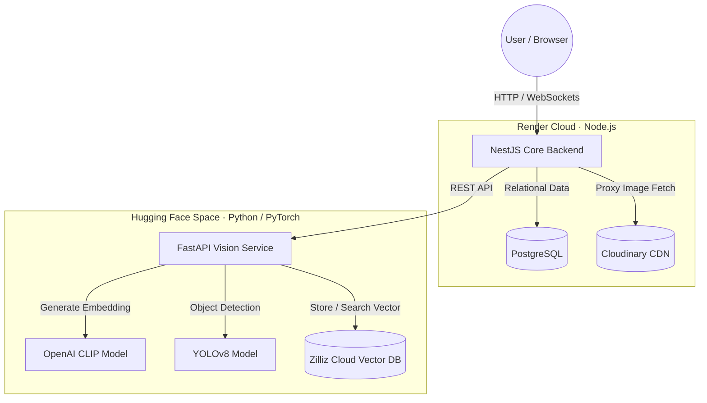

# 🔍 Universal Recovery System — Complete Project Summary

> **One-liner:** A full-stack, AI-powered Lost & Found platform that uses computer vision and vector similarity search to automatically identify and recover lost items through visual semantics — not keywords.

---

## 📌 Project Overview

Universal Recovery System replaces traditional text-based lost-and-found workflows with an intelligent, image-driven matching engine. Users can report lost or found items by uploading photos. The system uses OpenAI's CLIP neural network to convert those images into mathematical vectors (embeddings), stores them in a specialized vector database, and then allows anyone to search by uploading a photo or typing a natural-language description (e.g., *"a black backpack"*). The system performs **cosine similarity** matching across all stored vectors and returns the most visually similar items — even if no textual metadata matches. Users who find a match can then communicate in real-time via a built-in WebSocket-powered chat system.

---

## 🏗️ System Architecture

The project follows an **isolated microservices architecture** distributed across three cloud providers. Heavy AI inference is deliberately decoupled from the core API gateway to prevent blocking and allow independent scaling.

### Three-Service Breakdown

| Service | Language | Framework | Deployed On |
|---|---|---|---|
| **Web Client** (Presentation Layer) | TypeScript | React 19 + Vite | Render (Static Site) |
| **Core Backend** (API Gateway & Orchestrator) | TypeScript | NestJS 11 | Render (Web Service) |
| **Vision Service** (AI/ML Engine) | Python | FastAPI + PyTorch | Hugging Face Spaces (Docker) |

### Four-Database Strategy

| Database | Type | Purpose |
|---|---|---|
| **PostgreSQL** (Render) | Relational (SQL) | Users, Items, Conversations, Messages — canonical truth |
| **Zilliz Cloud** (Milvus-compatible) | Serverless Vector DB | 512-dimensional CLIP embeddings for similarity search |
| **Cloudinary** | Cloud CDN / Object Storage | Raw image and media file storage |
| **Redis** *(Docker local dev)* | In-memory Key-Value | Caching & message queue (local development) |

---

## 🛠️ Complete Tech Stack

### Frontend
- **React 19** — Latest React with concurrent features
- **TypeScript** — Full static type safety
- **Vite 7** — Next-generation build tool with instant HMR
- **TailwindCSS v4** — Utility-first CSS framework (via `@tailwindcss/vite` plugin)
- **React Router v7** — Client-side routing with 10+ routes
- **Axios** — HTTP client with interceptors and credential forwarding
- **Socket.IO Client** — Real-time WebSocket communication
- **Lucide React** — Icon library
- **clsx + tailwind-merge** — Dynamic className composition utilities

### Backend (API Gateway)
- **NestJS 11** — Enterprise-grade Node.js framework with modular architecture
- **TypeORM** — Object-Relational Mapper with entity decorators and migrations
- **PostgreSQL 15** (via `pg` driver) — Primary relational database
- **Passport.js** — Authentication middleware (JWT strategy)
- **@nestjs/jwt** — JSON Web Token signing and verification
- **bcrypt** — Password hashing with salted rounds
- **Multer** — Multipart file upload handling
- **Cloudinary SDK** — Direct image upload via stream piping
- **Streamifier** — Buffer-to-stream conversion for Cloudinary uploads
- **Nodemailer** — Transactional email (password reset via Gmail SMTP)
- **Socket.IO** — WebSocket server for real-time chat
- **cookie-parser** — Secure HTTPOnly cookie parsing
- **class-validator + class-transformer** — DTO validation with decorators
- **Axios** — Internal HTTP calls to the Vision Service
- **form-data** — Multipart form construction for inter-service communication

### AI / Vision Service
- **FastAPI** — High-performance async Python web framework
- **PyTorch** — Deep learning tensor computation framework
- **Hugging Face Transformers** — Model loading and inference pipeline
- **OpenAI CLIP** (`clip-vit-base-patch32`) — Vision-Language model for generating 512D embeddings
- **YOLOv8 Nano** (Ultralytics) — Real-time object detection neural network
- **Pillow (PIL)** — Image preprocessing and format conversion
- **NumPy** — Numerical array operations
- **PyMilvus** — Python SDK for Milvus/Zilliz vector database
- **Uvicorn** — ASGI server for production deployment

### DevOps & Infrastructure
- **Docker** — Containerized Vision Service with multi-stage Dockerfile
- **Docker Compose** — Local development orchestration (PostgreSQL, Redis, MinIO, Milvus)
- **Render** — Cloud hosting for backend + frontend + PostgreSQL
- **Hugging Face Spaces** — GPU-enabled hosting for AI inference service
- **render.yaml** — Infrastructure-as-Code deployment blueprint
- **Artillery** — Load testing framework (YAML-based test scenarios)
- **ESLint + Prettier** — Code quality and formatting
- **Jest + Supertest** — Unit and E2E testing framework

---

## 🧠 AI / Machine Learning Concepts

### 1. CLIP (Contrastive Language-Image Pretraining)
- Developed by **OpenAI**, CLIP is a neural network trained on 400 million image-text pairs from the internet
- It learns a **shared embedding space** where images and text can be directly compared
- The model used is `clip-vit-base-patch32` which uses a **Vision Transformer (ViT)** as the image encoder
- Outputs a **512-dimensional float vector** for any input (image or text)
- This enables **cross-modal search**: searching images with text queries and vice versa

### 2. Vector Embeddings & Similarity Search
- Every uploaded image is converted into a **512-dimensional floating-point array** (vector embedding)
- These vectors capture the **semantic meaning** of the image — not pixels, but concepts
- Search is performed using **Inner Product (IP) similarity** on L2-normalized vectors, which is mathematically equivalent to **Cosine Similarity**
- Cosine similarity measures the angle between two vectors in high-dimensional space — smaller angle = more similar
- The formula: `similarity = (A · B) / (||A|| × ||B||)`, range: [-1, 1]

### 3. Vector Normalization
- All CLIP outputs are **L2-normalized** before storage: `vector / ||vector||₂`
- This ensures all vectors lie on a unit hypersphere, making Inner Product equivalent to Cosine Similarity
- Normalization prevents magnitude bias — only direction (semantic meaning) matters

### 4. YOLOv8 Object Detection
- **You Only Look Once (YOLO)** v8 Nano model performs real-time object detection on uploaded images
- Runs at a confidence threshold of 0.25 to maximize detection coverage
- Detected object labels (e.g., "backpack", "phone", "bottle") are appended to the item description
- This enriches the metadata stored alongside each vector for better context

### 5. IVF_FLAT Indexing
- The vector database uses **Inverted File Index with Flat quantization** (IVF_FLAT)
- Vectors are partitioned into 128 clusters (nlist=128) using k-means
- At search time, only the nearest 10 clusters are scanned (nprobe=10), dramatically reducing search time
- This is an **Approximate Nearest Neighbor (ANN)** algorithm — trades minor accuracy for massive speed gains

### 6. Cross-Modal Search
- Because CLIP maps both images and text into the **same 512D vector space**, users can:
  - Upload a **photo** → system generates image embedding → searches against stored image embeddings
  - Type a **text description** → system generates text embedding → searches against stored image embeddings
- This is the key innovation: a text query like *"red umbrella"* will match a photo of a red umbrella even if no text metadata exists

### 7. Filtered Vector Search
- Search queries support boolean metadata filtering (e.g., `is_lost == true`)
- Milvus applies the scalar filter **before** the ANN search, narrowing the candidate set
- This allows users to search specifically for lost items or found items

---

## 🔐 Security & Authentication Architecture

### Cookie-Based JWT Authentication
- The system uses **HTTPOnly secure cookies** instead of localStorage/sessionStorage for JWT storage
- This prevents **Cross-Site Scripting (XSS)** attacks from stealing tokens — JavaScript cannot access HTTPOnly cookies
- Cookie configuration: `httpOnly: true`, `secure: true`, `sameSite: 'none'`, 7-day expiry
- The `trust proxy` flag is enabled for Render's AWS load balancer to correctly identify HTTPS connections

### Passport.js JWT Strategy
- Custom JWT extraction from cookies (not the Authorization header)
- Token payload contains `sub` (user ID) and `email`
- Strategy validates and attaches the user object to every protected request

### Password Security
- Passwords are hashed with **bcrypt** using 10 salt rounds before storage
- Raw passwords are never stored or logged
- Password comparison uses timing-safe bcrypt comparison

### Password Reset Flow
- User requests reset → system generates a short-lived JWT (15-minute expiry) containing their email
- JWT is sent via **Nodemailer** through Gmail SMTP as a clickable reset link
- User clicks link → frontend extracts token from URL → sends new password + token to backend
- Backend verifies the JWT, extracts the email, and updates the password

### CORS Configuration
- Whitelist-based CORS with regex patterns for Render's dynamic subdomains
- `credentials: true` enables cookie transmission across origins
- Supports both local development (`localhost:5173`) and production (`.onrender.com`)

### WebSocket Authentication
- Socket.IO connections are authenticated by parsing the `cookie` header on connection
- The JWT is extracted from the cookie, verified, and the user ID is mapped to the socket ID
- Unauthenticated connections are immediately disconnected

---

## 📦 Backend Module Architecture (NestJS)

The backend follows NestJS's **modular architecture pattern** with dependency injection:

### 1. Auth Module
- **Controller:** `/auth/signup`, `/auth/login`, `/auth/logout`, `/auth/me`, `/auth/forgot-password`, `/auth/reset-password`
- **Service:** Handles registration (with duplicate email detection), login (credential verification), JWT signing, and password reset logic
- **JWT Strategy:** Custom Passport strategy extracting JWTs from cookies
- **Email Service:** Nodemailer-based transactional email for password reset links
- **Debug Guard:** Development utility that logs cookie and token state for debugging authentication issues

### 2. Users Module
- **Controller:** `/users/profile` (GET & PUT)
- **Service:** CRUD operations for user entities, profile retrieval, and password updates
- **Entity:** `User` — id, name, email (unique), password (hashed), createdAt

### 3. Items Module
- **Controller:** `/items` (GET all user items), `/items` (POST create), `/items/search` (POST), `/items/image/proxy` (GET)
- **Service:**
  - **Create flow:** Upload image to Cloudinary → Save item to PostgreSQL → Forward image to Vision Service for CLIP embedding + YOLO detection → Store vector in Zilliz
  - **Search flow:** Forward query (image/text) to Vision Service → Receive top-5 vector matches with external IDs → Hydrate results from PostgreSQL using `IN` clause → Return combined results
  - **Proxy flow:** Receives Cloudinary URL, fetches the raw image blob, and pipes it directly to the client — bypasses ISP/browser tracking blocks
- **Entity:** `Item` — id, name, description, location, isLost (boolean), imageUrl, userId, detectedObjects (string array), createdAt
- **DTO:** `CreateItemDto` with class-validator decorators for input validation

### 4. Chat Module
- **Controller:** REST endpoints for creating/retrieving conversations and messages
- **Service:**
  - Conversation deduplication using normalized user ID pairs: `[min(a,b), max(a,b)]`
  - Last message preview for inbox display
  - Chronological message retrieval
- **WebSocket Gateway:**
  - Room-based architecture: each conversation has a dedicated room (`conversation_{id}`)
  - Users join/leave rooms dynamically
  - Messages are broadcast to all room members in real-time
  - Cookie-based authentication on WebSocket handshake
- **Entities:**
  - `Conversation` — id, user1Id, user2Id, createdAt, updatedAt
  - `Message` — id, conversationId, senderId, content (text), createdAt

---

## 🖥️ Frontend Architecture (React)

### Routing (11 Routes)
| Route | Page | Auth Required |
|---|---|---|
| `/` | Home (landing page) | No |
| `/login` | Login form | No |
| `/signup` | Registration form | No |
| `/search` | AI-powered search (text/image) | No |
| `/report-lost` | Report a lost item with image upload | Yes |
| `/report-found` | Report a found item | Yes |
| `/inbox` | Real-time chat inbox | Yes |
| `/profile` | User profile + reported items | Yes |
| `/forgot-password` | Password reset request | No |
| `/reset-password` | Password reset form (token-based) | No |

### State Management
- **AuthContext:** Global authentication state using React Context API. On mount, calls `/auth/me` to check for existing session cookie. Provides `user`, `setUser`, and `loading` to the entire app tree.
- **SocketContext:** Manages Socket.IO lifecycle tied to authentication state. Connects when user is present, disconnects on logout. Provides the socket instance to chat components.

### Key Frontend Patterns
- **Axios instance** with `withCredentials: true` for automatic cookie forwarding on every request
- **Request/Response interceptors** for logging and centralized error handling
- **Image proxy pattern:** All Cloudinary images are rendered through the backend proxy route (`/items/image/proxy?url=...`) to bypass ISP firewalls and browser tracker blocking (e.g., Brave Shields)
- **Real-time messaging:** ChatWindow component joins socket rooms, listens for `newMessage` events, and auto-scrolls to the latest message
- **Form-based file uploads:** Uses `FormData` API for multipart image uploads to the search and report endpoints

---

## 🔀 Core Data Flow: End-to-End Search Sequence

```mermaid
sequenceDiagram
    participant Client as React Browser
    participant Nest as NestJS Backend
    participant Cloud as Cloudinary
    participant Fast as FastAPI (HF Space)
    participant Zil as Zilliz Vector DB
    participant PG as PostgreSQL

    Client->>Nest: 1. Upload query image or text
    Nest->>Fast: 2. POST /search (multipart form)
    
    rect rgb(40, 40, 120)
        Note right of Fast: AI Inference Phase
        Fast->>Fast: 3. CLIP generates 512D vector
        Fast->>Fast: 4. L2 normalize the vector
    end

    Fast->>Zil: 5. ANN search with IP metric + is_lost filter
    Zil-->>Fast: 6. Return top 5 matches (IDs + scores)
    Fast-->>Nest: 7. JSON array of {external_id, score}
    
    rect rgb(40, 80, 40)
        Note left of PG: Relational Hydration
        Nest->>PG: 8. SELECT * FROM items WHERE id IN (...)
        PG-->>Nest: 9. Full item records with Cloudinary URLs
    end

    Nest-->>Client: 10. Enriched match results
    Client->>Nest: 11. GET /items/image/proxy?url=cloudinary_url
    Nest->>Cloud: 12. Fetch raw CDN blob
    Cloud-->>Client: 13. Piped image stream renders in UI
```

---

## 🔀 Core Data Flow: Item Registration Sequence

1. **User uploads** an image + metadata (name, description, location, isLost) via the React form
2. **NestJS receives** the multipart request, extracts the file buffer
3. **Cloudinary upload:** The raw image buffer is converted to a readable stream via `streamifier` and piped to Cloudinary's upload stream API. Returns a secure CDN URL.
4. **PostgreSQL insert:** A new `Item` record is created with all metadata + the Cloudinary URL
5. **Vision Service call:** NestJS constructs a new `FormData` with the original file buffer, item ID, description, and `is_lost` flag, then POSTs to the FastAPI `/analyze` endpoint
6. **YOLO detection:** The Vision Service runs YOLOv8 on the image, detecting objects with >25% confidence
7. **CLIP embedding:** The image passes through the CLIP Vision Transformer, producing a 512D tensor. The tensor is L2-normalized.
8. **Vector storage:** The normalized embedding, external ID (PostgreSQL item ID), enriched description, and `is_lost` boolean are inserted into the Zilliz collection
9. **Metadata update:** Detected object labels are returned to NestJS and saved to the `detectedObjects` column in PostgreSQL

---

## 🐳 DevOps & Deployment

### Docker Compose (Local Development)
Four containers orchestrated locally:
1. **PostgreSQL 15 Alpine** — Relational database (port 5432)
2. **Redis 7 Alpine** — Cache and message queue (port 6379)
3. **MinIO** — S3-compatible object storage with web dashboard (ports 9000/9001)
4. **Milvus v2.3.0 Standalone** — Local vector database with embedded etcd (port 19530)

### Vision Service Dockerfile
- Base: `python:3.10-slim`
- Installs system dependencies for OpenCV (libgl1, libglib2.0)
- Installs PyTorch, Transformers, PyMilvus, Ultralytics (YOLO)
- **Pre-downloads CLIP model weights** during build to avoid cold-start latency on Hugging Face Spaces
- Bundles `yolov8n.pt` weights directly into the image
- Runs as unprivileged user (UID 1000) per Hugging Face security requirements
- Exposes port 7860 (Hugging Face standard)

### Render Deployment (render.yaml — Infrastructure as Code)
- **core-backend:** Node.js web service with auto-build (`npm install && npm run build`), production start (`node dist/main`), environment variables injected from Render dashboard + auto-generated JWT secret
- **web-client:** Static site with Vite build, SPA rewrite rules (all routes → `index.html`), dist folder published
- **urs-postgres:** Managed PostgreSQL instance (free tier)

### Cloud Provider Distribution
| Provider | Component | Why |
|---|---|---|
| **Render** | Frontend, Backend, PostgreSQL | Managed Node.js hosting with free PostgreSQL addon |
| **Hugging Face Spaces** | Vision Service (Docker) | Free GPU compute for AI inference |
| **Zilliz Cloud** | Vector Database | Serverless Milvus — persistent, scalable, no infra management |
| **Cloudinary** | Image Storage | Optimized CDN delivery with transformation APIs |
| **Gmail SMTP** | Transactional Email | Password reset emails via Nodemailer |

---

## 🧪 Testing & Quality

- **Artillery Load Testing** — YAML-defined scenarios testing the Vision Service at increasing loads:
  - Warm-up: 2 RPS for 20 seconds
  - Rush Hour: 5 RPS for 40 seconds
  - Max Capacity: 15 RPS for 20 seconds (failure expected)
- **Jest + ts-jest** — Unit testing framework for NestJS backend
- **Supertest** — HTTP assertion library for E2E API testing
- **ESLint + Prettier** — Enforced code quality and consistent formatting
- **Debug Auth Guard** — Custom NestJS guard that logs cookie state and token verification for development debugging

---

## 📈 Hyper-Scale Architecture Blueprint (100K RPS)

The project includes a detailed scaling document outlining the path from 5 RPS to 100,000 RPS:

### Key Scaling Strategies
1. **Edge Caching (Cloudflare/CloudFront):** Static assets + cached search results absorb ~40% of traffic at the CDN layer
2. **Horizontal Scaling:** 50-100 NestJS containers behind Kubernetes HPA with L7 load balancing
3. **Event-Driven Architecture:** Replace synchronous AI calls with **Apache Kafka** message queue — NestJS drops image references into the queue and immediately returns `202 Accepted`
4. **GPU Worker Clusters:** Hundreds of FastAPI workers on NVIDIA instances consuming from Kafka, with auto-scaling based on queue depth
5. **Inference Batching:** Workers grab 64 images at once, stack into tensor batches, and run through CLIP simultaneously — 1000%+ throughput increase
6. **Connection Pooling:** PgBouncer in front of Amazon Aurora PostgreSQL with 15+ read replicas
7. **Distributed Vector DB:** Milvus distributed cluster on Kubernetes with separated Data/Index/Query nodes
8. **WebSocket Scaling:** Redis Pub/Sub adapter to synchronize Socket.IO across 100+ NestJS pods

---

## 🧩 Key Engineering Concepts Used

| Concept | Where Applied |
|---|---|
| **Microservices Architecture** | Three independent services communicating over HTTP/REST |
| **Vector Embeddings** | CLIP model converts images/text into 512D mathematical representations |
| **Approximate Nearest Neighbor (ANN)** | IVF_FLAT index for sub-millisecond similarity search |
| **Cross-Modal Search** | Text queries match against image embeddings in shared vector space |
| **Cosine Similarity** | Semantic matching via Inner Product on L2-normalized vectors |
| **Object Detection** | YOLOv8 identifies objects in uploaded images for metadata enrichment |
| **JWT Authentication** | Stateless auth with HTTPOnly secure cookies |
| **WebSocket (Socket.IO)** | Bidirectional real-time chat with room-based broadcasting |
| **Image Proxy / ISP Bypass** | Backend proxies CDN images to circumvent tracker blocking |
| **Stream Processing** | Buffer-to-stream piping for Cloudinary uploads and image proxying |
| **ORM (TypeORM)** | Declarative entity mapping with auto-migration |
| **DTO Validation** | class-validator decorators for type-safe input validation |
| **Dependency Injection** | NestJS IoC container for modular, testable architecture |
| **Infrastructure as Code** | render.yaml and docker-compose.yml define entire deployment |
| **Multi-Cloud Distribution** | Services span Render, Hugging Face, Zilliz, and Cloudinary |
| **Event-Driven Scaling** | Kafka-based async processing blueprint for production scale |
| **Connection Pooling** | PgBouncer pattern for database connection management at scale |
| **CORS with Credentials** | Secure cross-origin cookie transmission with regex-based whitelisting |
| **Trust Proxy** | Express/NestJS configuration for correct HTTPS detection behind load balancers |
| **Container Orchestration** | Docker Compose for local dev, Kubernetes blueprint for production |

---

## 📝 Resume Bullet Points (Ready to Copy)

> - Architected and built a **full-stack AI-powered Lost & Found platform** using a microservices architecture spanning NestJS, FastAPI, React, and four databases (PostgreSQL, Zilliz/Milvus, Cloudinary, Redis)
> - Implemented **computer vision search** using OpenAI's CLIP model to generate 512-dimensional vector embeddings, enabling cross-modal search where text queries match against image embeddings via cosine similarity
> - Integrated **YOLOv8 object detection** for automatic item classification and metadata enrichment of uploaded images
> - Built a **serverless vector similarity search** pipeline using Zilliz Cloud with IVF_FLAT indexing and filtered ANN queries, returning top-5 semantic matches in sub-second latency
> - Designed a **secure cookie-based JWT authentication** system with bcrypt password hashing, Passport.js strategy, and Nodemailer-based password reset flow
> - Developed a **real-time WebSocket chat system** using Socket.IO with room-based broadcasting, cookie-based handshake authentication, and conversation deduplication
> - Engineered an **image proxy bypass router** that pipes Cloudinary CDN blobs through the backend's first-party domain to circumvent ISP firewalls and browser tracker blocking
> - Deployed across **four cloud providers** (Render, Hugging Face Spaces, Zilliz Cloud, Cloudinary) with Infrastructure-as-Code using render.yaml and Docker
> - Documented a **hyper-scale architecture blueprint** for 100K RPS using Kubernetes HPA, Apache Kafka event streaming, GPU inference batching, PgBouncer connection pooling, and distributed Milvus clusters
